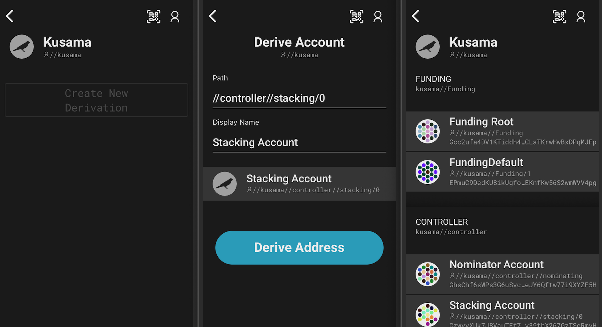
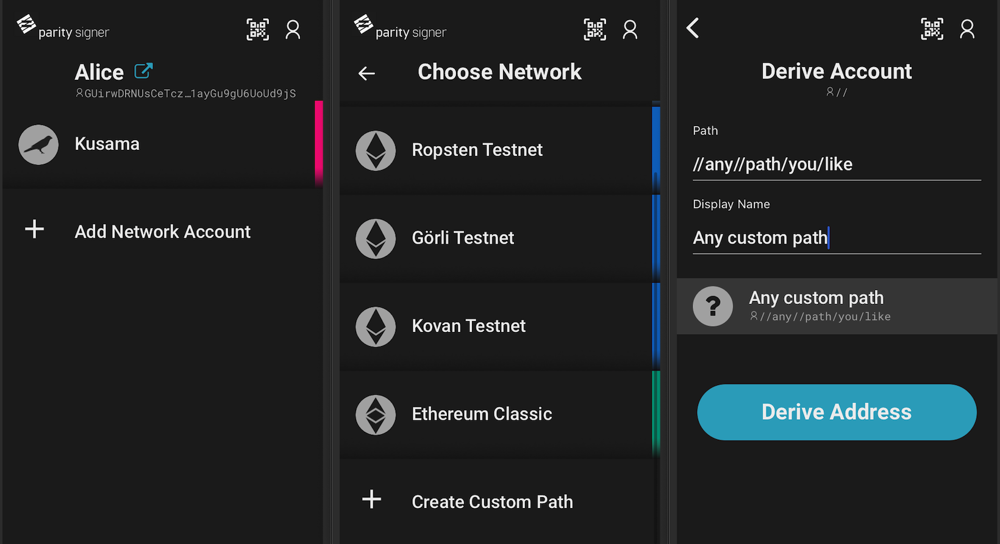

In the v4 Parity Signer, we have introduced the Hierarchical Deterministic Key Derivation(HDKD) feature on Substrate networks. This article explains how to use the feature.

## Introduction

Identity is the start point for generating accounts. Identity is bound to seed, but identity itself does not have network affiliation. On Substrate networks, generating a new account would be a case of entering a new path and stating its network affinity. With this feature, a user could manager as much as accounts with just one seed phrase safely stored.

## Key Generation

### Path derivation within a substrate network.

Key generation also refers to accounts creation, with your created Identity:
- Choose a Substrate network and open path list screen.
- Tap `Create New Derivation` Button.
- In path derivation screen, input any path and name you like, the path will be prefixed with its Network path ID, in the example case, is `//kusama`.
- Tap `Derive Address` Button.
- From the path list, you will see all the paths and their names within a Substrate network, they are automatically grouped.

### Custom path derivation

To generate a custom path without any prefix path:
- Tap `Add Network Account` on the network list screen.
- Tap `Create Custom Path` button on the bottom.
- Input any path you like.

### The form of path

Paths also refer to the Chaincodes which described in [BIP32](https://github.com/bitcoin/bips/blob/master/bip-0032.mediawiki/), though it is different from BIP-32 style:
* Soft derivation starts with a single slash, like: `/soft`
* Hard derivation starts with a double slash, like: `//hard`

Users are able to create any combination of hard derivation with `//` and/or soft derivation with `/`.

The encoded string are limited to 32 Bytes.

### Further notes

* Ethereum accounts will be generated after an Ethereum network is selected, no path is needed. 
* With the same BIP32 seed users could create accounts under different networks. But if a user has a brain wallet seed, it can only create Ethereum accounts. 
* The pin code is now bound to the identity instead of the account.
* Each derived account is prefixed with its network path id, which prevents it to be misused in another network.

## Technology Behind

### The difference of hard and soft derivated accounts.

Both hard and soft derivation will create new accounts/keypairs, and the following three ways work:

* Private parent key -> private child key
* Public parent key -> public child key (only works for soft keys)
* Private parent key -> public child key (for hard derived keys, it can only by the way that firstly derives child private key, and then derive child public key, for soft derived keys, there is an additional way is to first derive parent public key, and then derive the public key)

The key difference is that:
- hard: Public key does not have a corresponding derivation, a derived public key is not linked with the parent public key, it can not be proved. 
- soft: Public key has a corresponding derivation, derived public key is linked with parent public key, it can be proved. 

The soft derivation method has a pro here is that one could derive child public keys of a given parent key without knowing any private key.

### Use cases

Basically, the HDKD ease the management & storing of variant keys / recovery phrases. In addition to that it enables:

* sharing the whole identity.
* frequent transactions that cannot (easily) be associated with.
* distributing the keypairs in an organization.
* track different transactions by auditor / seller.

Especially for soft derivated keys:
One may distribute the public key instead of the private key, so that the owner's of the parent public key could derive child public key to monitor the transactions on the address.

### Potential Risks

Some related security reality is:

With child private key and path, could not find parent private key efficiently.
With a fixed order of private keys list, could not find parent private key efficiently.

And the followings are NOT true, which may lead to potential risks:

With parent and child public key, it is hard to find the path.
With parent public key and soften child private key, it is hard to find the parent private key.

NOTICE: If a derived soft child private key is compromised, and parent public key is exposed, then the risk for compromising parent private key will be raised. So the suggestion is if you use soft derivated child keypairs, then better not to sign and submit transactions with parent private key.

## References:
1. https://github.com/w3f/schnorrkel
2. https://wiki.polkadot.network/docs/en/learn-keys
3. https://github.com/bitcoin/bips/blob/master/bip-0032.mediawiki/
